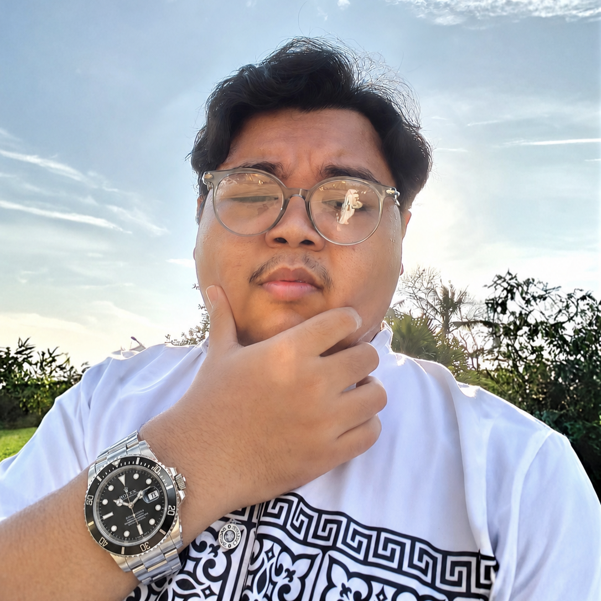

  
   
  <h1>Nawfal Irfan Ramadhan</h1>
  
<b>Frontend Developer • UI/UX Designer • Visual Enthusiast</b>

  

    
    
    
  

---

### 🚀 About Me

Halo! I'm **Nawfal**, a Frontend Specialist and TypeScript Developer based in Yogyakarta, Indonesia. I bridge the gap between multimedia design and modern engineering to build intuitive, visually stunning, and highly functional web applications.

- 🎓 **Undergraduate Informatics Student** @ Universitas Bina Sarana Informatika
- 🛠️ **Former Intern** @ Balai Teknologi Komunikasi Pendidikan DIY
- 🎨 **Design focused** on smooth user experiences and pixel-perfect layouts.

---

### 🛠️ Tech Stack

  
  
  
  
  
  
  

---

### 🌟 Featured Projects

#### 💻 [MacOS Clone](https://github.com/xFalzz/MacOS-clone)

A highly detailed MacOS desktop clone built with **Next.js**, **TypeScript**, and **Tailwind CSS**. Features a functional dock, menu bar, and window system.

#### 🔗 [QRQuick](https://qrquicks.vercel.app/)

A functional QR code generator focusing on utility and simplicity. Built with **TypeScript**, **Next.js**, and **Prisma**.

#### 🎮 [Particle Flow Squash](https://particleflowsquash.vercel.app/)

An interactive particle game using the **Canvas API**, **React**, and **TypeScript**. Experience smooth animations and physics-based interactions.

---

### 📈 GitHub Statistics

  
   
  

---

### 📬 Get in Touch

- 📧 **Email**: [nawfalirfan005@gmail.com](mailto:nawfalirfan005@gmail.com)
- 💼 **LinkedIn**: [Nawfal Irfan Ramadhan](https://www.linkedin.com/in/nawfal-irfan/)
- 🐦 **Twitter**: [@xFalzs](https://x.com/xFalzs)

  

